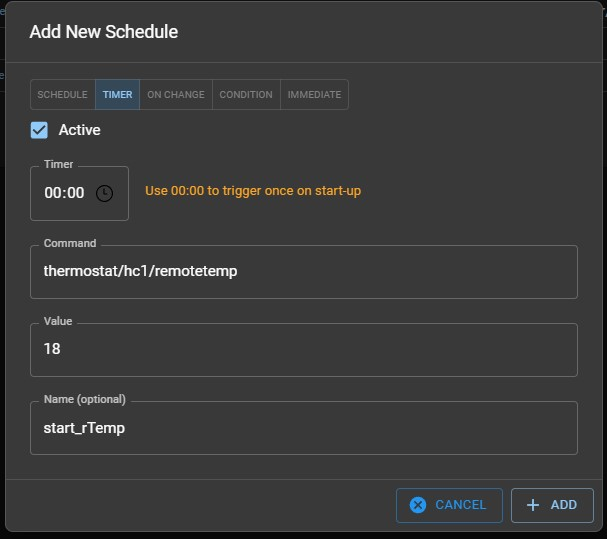
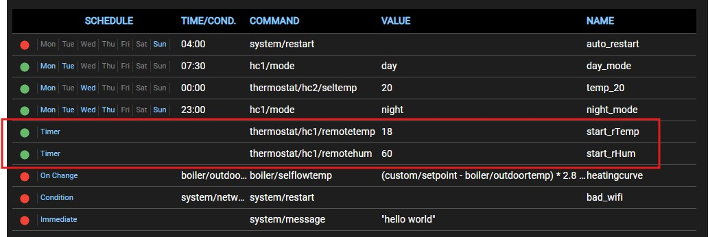

Some entities mapped in MQTT are generated by EMS-ESP and not read from the EMS bus.

`heating_active` and `tapwater_active` are calculated from the burner and valve/pump settings. These are used by both the Shower Timer and Energy Measurement features.

## Shower Timer

Measures the time hot water is running with burner on. This works only for dhw flow systems; in buffered dhw systems the time is always the charge time of the buffer.
As an additional feature, there is the Shower Alert, which alerts and triggers a burst of cold water after a configured time. The 'coldshot' is managed by the entity `boiler/tapactivated`, and uses a custom function that sets the boiler into its 'testmode', enables tapwater flow but disables the burner.

## Force Heating Off

Some users control the boiler without a thermostat and want to switch the boiler off when a desired temperature is reached. Sending `boiler/selflowtemp 0` to the boiler has to be repeated every minute otherwise the boiler will fall back to the selected temperature on the panel.

The function `boiler/forceheatingoff` repeats this command every minute, so the heating remains off. In the EMS-ESP settings it is possible to set the power on value of `forceheatingoff`.

## Energy Measurement

For gas and oil burners, Bosch does not measure the energy consumption. EMS-ESP calculates the consumption of each boiler message by burner modulation and nominal boiler power. Some gas boilers have the nominal power stored, some do not.
Also the stored power is not always correct, a boiler of same type could be equipped with different burners or have its burners adjusted by air/nozzle size.
In these cases, the nominal power `boiler/nonpower` can be changed and stored in EMS-ESP. Check the setting before using the energy values.

## Remote Thermostats

Modern thermostats can use the outdoor temperature to calculate the appropriate boiler flow temperature. A single thermostat placed inside the boiler can do this for different heating circuits, however is slow and inaccurate. If a room thermostat measures that the actual temperature is much lower it should raise the flowtemp to a much higher value until the temperature is reached. This is called "outdoorcontrolled" with "room influence" but requires a hardware remote thermostat present in the room. EMS-ESP can simulate a remote thermostat by calling `thermostat/hc<x>/control` and setting the temperature and other dhw settings via `thermostat/hcx/remotetemp`. This will also send the settings on to the master thermostat.

For a master thermostat of type RC30/RC35 an RC20 is emulated. For the RC3x0/BC400 you have to choose the control first to RC200 or RC100H. For a Junkers/Bosch FW120 and similar an FB10 is emulated.

To activate the Remote Thermostat feature follow these steps:

- set `thermostat/hc<x>/control` to the right Remote thermostat you want to control
- send `thermostat/hc<x>/remotetemp` with your desired temperature. Optionally for an RC100H send `thermostat/hc<x>/remotehum` with a value

EMS-ESP will search for the master thermostat and create a new thermostat with entities for room temperature and optionally humidity. The values will be automatically updated and synchronized with the master thermostat.

To stop the function, follow these steps:

- send `thermostat/hc<x>/remotetemp` with a value of `-1`
- set `thermostat/hc<x>/control` to the master thermostat (e.g. RC35/RC300/FW120...)

The remote thermostat will remain in the EMS-ESP device dashboard but will have no entities.

Note, if the control is set to `roomthermostat` and the first `remotetemp` is not set within a minute, the master thermostat will likely show an error message.

<!-- prettier-ignore -->
!!! warning "Disclaimer"
    With the remote setting of the humidity you are able to set a heat pump to start cooling even when it is below the actual dew point, which can cause condensation on pipes and the floor, and subsequently damage the system. Use at your own risk!

### Scheduling temperatures

The EMS-ESP Scheduler can be used to permanently maintain the remote thermostat's values. The thermostat is recreated once the command is and has an initial value as shown below:

- `Timer` to `00:00` for triggering as soon as EMS-ESP powers on
- `Command` is `thermostat/hc1/remotetemp` for heating circuit 1 (or `thermostat/hc1/remotehum` for an RC100H)
- `Value` is the optimal room temperature for your home, or a command (see below)
- `Name` is optional. By giving it a name it can be set remotely as a command and the activation state is published in an MQTT topic.

If you have an external Dallas temperature sensor attached to the EMS-ESP you can set the `value` to this value by using `temperaturesensor/<dallas_id_or_name>` as the `value`.

With both a temperature and humidity value set, the emulated RC100H would look lie this:

